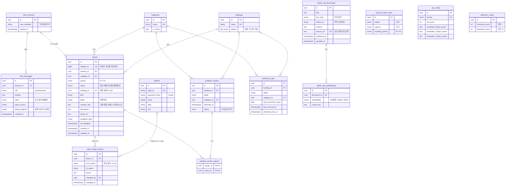

# ERD (DB 스키마)

> 실제 스키마의 원본은 `app/models/`(ORM 모델)와 `alembic/versions/`(마이그레이션)다.
> 이 그림은 이해를 돕기 위한 요약이므로, 모델을 바꾸면 이 문서도 같이 고칠 것.
> GitHub에서 이 파일을 열면 아래 다이어그램이 그림으로 보인다.

- PK는 전부 UUID(`gen_random_uuid()`), 시간은 `timestamptz`
- 모든 테이블 RLS 켜짐 (Supabase REST API 외부 노출 차단, 마이그레이션 `0003`)
- 설정 테이블 초기값·관리자 계정 시드는 마이그레이션 `0002`

